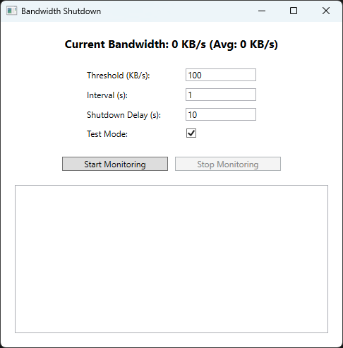
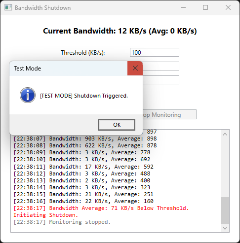

# 📡 Bandwidth Monitor & Auto Shutdown

A lightweight Windows utility that monitors your network bandwidth in real time and automatically shuts down the system if bandwidth usage falls below a defined threshold for a specified period.

---

## 🚀 Features

- 📶 **Live Monitoring**: Tracks total **received bandwidth** across all active network interfaces.
- ⏱️ **Auto Shutdown**: If the average bandwidth remains below a configurable limit for a set duration, the machine will automatically shut down.
- 💾 **Persistent Settings**: Your configurations are saved automatically between sessions.
- 🧪 **Safe Testing Mode**: Prevents actual shutdown during testing. **Enabled by default.**

---

## 🗂 Files Included

- `BandwidthShutdown.exe` — Main executable. Launch this to start monitoring.

---

## 🖥️ Requirements

- Windows 10 or later
- No installation or .NET runtime required (self-contained build)

---

## 📦 How to Use

1. [Download the latest release](https://github.com/Thoman46/BandwidthShutdownApp/releases).
2. Extract and run `BandwidthShutdown.exe`.
3. Adjust your settings (threshold, time window, etc.).
4. Click **Start Monitoring**.
5. If bandwidth stays below the set limit, the PC will automatically shut down after the configured time.

> ℹ️ Enable or disable test mode to simulate behavior without triggering an actual shutdown.

---

### 🖼️ UI Screenshots

  
  
  

---
## 🔐 Security

This application does **not** transmit data. It runs entirely offline and uses Windows APIs to access local bandwidth metrics.

---

## 📄 License

This project is licensed under the [MIT License](LICENSE).

---

## ✉️ Feedback & Issues

Found a bug or have a feature request? [Open an issue](https://github.com/Thoman46/BandwidthShutdownApp/issues).
